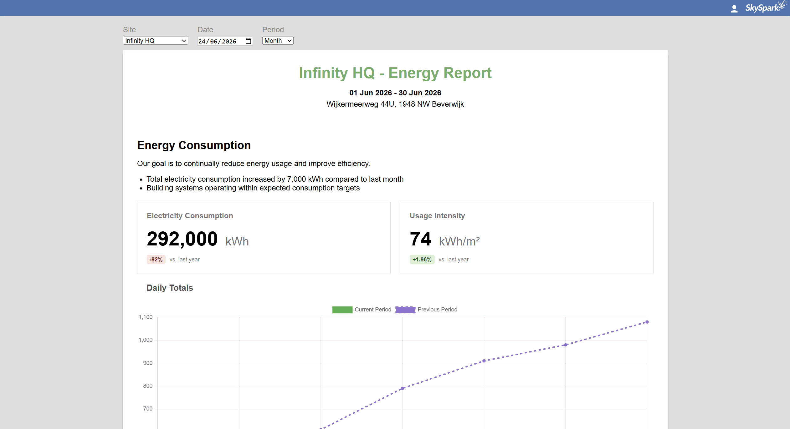

# Energy Dashboard

An interactive energy reporting dashboard built with HTML, CSS, JavaScript and Chart.js.

## Demo

  

## Features

- Site selection
- Date selection
- Week, Month and Quarter reporting
- Dynamic KPI cards
- Interactive charts
- Dynamic report header

## Technologies

- HTML
- CSS
- JavaScript
- Chart.js

## Applicatie starten
Download of clone de repository.
Open de projectmap in Visual Studio Code.
Installeer de extensie Live Server (indien nog niet aanwezig).
Open index.html met Open with Live Server.
Het Energy Dashboard wordt geopend in de browser.
